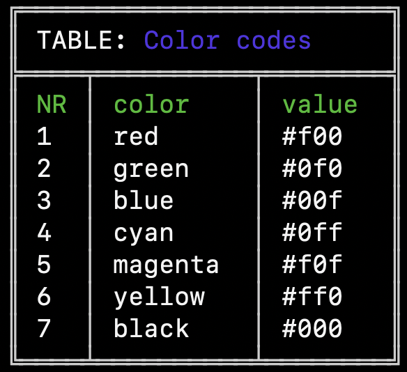

# CLI Core for TIBCO Cloud™

If you want to develop a CLI plugin for TIBCO Cloud™, use this package to get some features OOTB.
Using this package won't only give features but will help in maintaining a unified, consistent user experience for the end user.

## Table of Contents

1. [Get started](#get-started)
2. [Command Class](#commands)
    1. [BaseCommand](#basecommand)
    2. [TCBaseCommand](#tcbasecommand)
3. [Logging to the terminal](#logging-to-terminal)
4. [Error Handling](#error-handling)
5. [HTTP Requests](#http-requests)
    1. [HTTPRequest](#httprequest)
    2. [TCRequest](#tcrequest)
6. [Plugin Configurations](#plugin-configurations)
7. [UX](#ux)
8. [API Documentation](#api-documentation)
9. [Issue](#issues)
10. [License](#license)

## Get started

- This CLI is based on oclif framework, you will first need to install [oclif](https://oclif.io/) framework on your machine.

  ```bash
  npm install -g oclif@1.18.0
  ```

- Install [TIBCO Cloud CLI](https://github.com/TIBCOSoftware/cic-cli-main) on your machine.

- Generate the CLI plugin and install CLI core package.

  ```
  oclif plugin <your plugin name>
  cd <your plugin name>
  npm i @tibco-software/cic-cli-core
  ```

- Create topic (group) for your commands.
  ```
  oclif command <Your topic name>:hello
  ```

- Link your plugin to the TIBCO Cloud CLI.
  ```
  tibco plugins:link <absolute path of your plugin>
  ```

- Test your hello command.

  ```
  tibco <your topic name>:hello
  ```

> **_NOTE:_** The TIBCO Cloud CLI works on oclif 1.18.x version. Please consider using the same version of oclif while developing the plugin.

## Commands

### BaseCommand

Extend this class when you want to create any command which is executed on the machine locally or when you want to communicate with third party tools.

```ts
import { flags } from '@oclif/command';
import { BaseCommand } from '@tibco-software/cic-cli-core';

export default class GenDirCommand extends BaseCommand {
  static description = 'Creates directory';

  static examples = [`tibco fs:gen-dir --path . mydir`];

  static flags: flags.Input<any> & typeof BaseCommand.flags = {
   
   ...BaseCommand.flags,
   
   path: flags.string({
      char: 'p',
      description: 'Path other the cwd',
      required: false,
    }),
  };

  static args = [{ name: 'dirName' }];

  async init() {
    await super.init();
    // Do any other initialization
  }

  async run() {
    // Write your logic here

    // If want to make any http requests to 3rd party tools
    let httpReq = this.getHTTPRequest();
  }

  async catch(err: Error) {
    // add any custom logic to handle errors from the command
    // or simply return the parent class error handling
    return super.catch(err);
  }
  async finally(err: Error) {
    // called after run and catch regardless of whether or not the command errored
    return super.finally(err);
  }
}
```

### TCBaseCommand

Extend this class when you want to make API requests to TIBCO Cloud and manage profile configurations.

> **_NOTE:_** TCBaseCommand extends BaseCommand

```ts
import { flags } from '@oclif/command';
import { TCBaseCommand } from '@tibco-software/cic-cli-core';

export default class ShowAppsCommand extends TCBaseCommand {
  static description = 'Show Apps on TIBCO Cloud';

  static examples = [`tibco tc:show-apps --all`];

  static flags: flags.Input<any> & typeof TCBaseCommand.flags = {
   
   ...TCBaseCommand.flags,
   
   all: flags.boolean({
      char: 'a',
      description: 'show other owner apps',
      required: false,
    }),
  };

  async init() {
    await super.init();
    // Do any other initialization
  }

  async run() {
    // Write your logic here

    // to make any http requests to 3rd party tools
    let httpReq = this.getHTTPRequest();

    // to make any http requests to TIBCO Cloud
    let tcReq = this.getTCRequest();

    // to read Config
    let config = this.getProfileConfig();

    // to save config
    this.saveProfileConfig(config);

    // to reload config
    this.reloadProfileConfig();
  }

  async catch(err: Error) {
    // add any custom logic to handle errors from the command
    // or simply return the parent class error handling
    return super.catch(err);
  }
  async finally(err: Error) {
    // called after run and catch regardless of whether or not the command errored
    return super.finally(err);
  }
}
```

Alternatively you can also import Requests module from package

```ts
import { HTTPRequest, TCRequest } from '@tibco-software/cic-cli-core';

let req = new HTTPRequest('commandName', 'pluginName');
let tcReq = new TCRequest(profile, 'clientId', 'commandName', 'pluginName');
```

## Logging to terminal

If you are in Command class then simply use OOTB methods of logging.

```ts
async run() {
  this.log("Hello world");
  this.warn("File is getting replaced");
  this.debug("File not found, generating file");
  this.error("Failed to open app");
}
```

In case, you are not in Command class then use Logger

```ts
import { Logger, CLIBaseError } from '@tibco-software/cic-cli-core';

Logger.log('Hello world');
Logger.warn('File is getting replaced');
Logger.debug('File not found, generating file');
throw new CLIBaseError('Failed to open an app');

// for info on debugging see https://www.npmjs.com/package/debug
// if you want to add your namespace to debugging
let debug = Logger.extendDebugger("interceptor");
debug("My debugging namespace");
```

## Error handling

Use `CLIBaseError` class to throw errors. These errors are friendly and won't show a traceback unless debugging is enabled with env variable `DEBUG=*` or `CLI_NAME_DEBUG=1`.

You can extend `CLIBaseError` class to create more error classes.
For e.g. we created HTTPError class

```ts
export class HTTPError extends CLIBaseError {
  httpCode?: string | number;
  httpHeaders?: { [index: string]: any };
  httpResponse?: any;
  constructor(message: string, httpCode?: string | number, httpResponse?: any, httpHeaders?: { [index: string]: any }) {
    super(message);
    this.httpCode = httpCode;
    this.httpHeaders = httpHeaders;
    this.httpResponse = httpResponse;
    this.name = 'HTTPError';
  }
}
```

## HTTP Requests

Requests module adds a wrapper on top of axios to simplify http requests

It will add some basic info to http requests -

- add proxies if needed
- User-Agent header
- timeout (30s) - If the request takes longer than `timeout`, the request will be aborted.
- connection (close)

Use `HTTPRequest` class to make requests to any third party tools.\
Use `TCRequest` class while making request to TIBCO Cloud. `TCRequest` will take care of tokens, renew token when expired, add regions in endpoint based on the profile.

Check [axios options](https://github.com/axios/axios#request-config) for options parameter in all request methods

### HTTPRequest

#### doRequest

```ts
import {HTTPRequest} from '@tibco-software/cic-cli-core';
...
let req = new HTTPRequest('cmdName', 'pluginName');

// doRequest(url, options?, data?)
let resp = await req.doRequest('https://api.mydomain.com/v1/apps/');  // default GET method
let resp2 = await req.doRequest('/v1/apps/scale', {baseURL: 'https://api.mydomain.com'}, {name:'myapp', count:2}); // default POST method if data parameter passed
let resp3 = await req.doRequest('https://api.mydomain.com/v1/apps/replace', {method: 'PUT'}, {}); // specify other methods from option's method property

Logger.log(resp.body);
Logger.log(resp.headers);
Logger.log(resp.statusCode);
```

`doRequest` will throw error (instance of `HTTPError`) if response statusCode is in 4xx or 5xx.

#### getAxiosClient

Use this method if you want to make an http request instead of cli-core package making it for you\
It will return an `axios` instance with some basic options added to it.\
For `axios` instance methods checkout this part of [`axios methods`](https://www.npmjs.com/package/axios#instance-methods).

```ts
let req = new HTTPRequest('cmdName', 'PluginName');
let client = req.getAxiosClient();
let axiosResp = await client.get('https://api.mydomain.com/v1/apps/', {});
Logger.log(axiosResp.data);
Logger.log(axiosResp.status);
Logger.log(axiosResp.headers);
```

#### upload

Use this method to upload files when required `Content-Type` is `multipart/form-data`.\
Pass data parameter in `{key: value}` format and path of a file as value with a prefix `file://`. \
You can also show progress bar on terminal by just passing last parameter `true` to the function. \
It is recommended to show progress bar when file size more than 64KB.

```ts
let req = new HTTPRequest('cmdName', 'PluginName');
let data = {
  artifact: 'file:///Users/foo/Desktop/artifacts.json',
  app: 'file:///Users/foo/Desktop/myapp.tgz',
  name: 'MyApp',
};

// upload(url, data, axios Options, showProgressBar)
let resp = await req.upload('https://api.mydomain.com/v1/apps/new', data, {}, true);
```

#### download

Use this method in case you need to download files.\
You can also show progress bar on terminal by just passing last parameter `true` ot the function.

```ts
let req = new HTTPRequest('cmdName', 'PluginName');

// download(url, pathToStore, axios Options, showProgressBar)
let isDownloaded = await req.download('https://api.mydomain.com/v1/apps/pull', '/Users/foo/Desktop/', {}, true);

if (isDownloaded === true) {
  Logger.log('File downloaded successfully');
}
```

### TCRequest

This module uses `HTTPRequest` to make calls to TIBCO Cloud.   
It takes care of tokens, renews them if expired before making a call. It also adds region to the endpoint based on current profile of the end user.  
[`https://api.cloud.tibco.com`](https://api.cloud.tibco.com) is considered as a base URL when only path is passed to the url parameter of functions.

#### doRequest

```ts
import { TCRequest } from '@tibco-software/cic-cli-core';
let tcReq = new TCRequest(profile, 'clientId', 'commandName', 'pluginName');

// doRequest(url, options, data?);
// url =  https://api.cloud.tibco.com, method = GET, headers = { Authorization: Bearer <token> , ...}
let res = await tcReq.doRequest('/v1/apps/');

// If profile has eu region
// url = https://eu.api.cloud.tibco.com, method = GET, headers = { Authorization: Bearer <token>, ...}
await tcReq.doRequest('/v1/apps');

// url = https://dev.tibco.com/userinfo, method = GET, headers = { Authorization: Bearer <token>, ...}
await tcReq.doRequest('/userinfo', { baseURL: 'https://dev.tibco.com' });

// If profile has eu region
// url = https://eu.dev.tibco.com/userinfo, method = GET, headers = { Authorization: Bearer <token>, ...}
await tcReq.doRequest('/userinfo', { baseURL: 'https://dev.tibco.com' });

// doRequest(url, options, data?);
// url =  https://api.cloud.tibco.com, method = POST, headers = { Authorization: Bearer <token> , ...}
await tcReq.doRequest('/v1/apps/', {} as AxiosRequestConfig, { otherOrgs: true });
```

#### getAxiosClient

Same as HTTPRequest's getAxiosClient, this one adds region to url, token to the header and returns axios instance

#### upload and download

Both methods are same as HTTPRequest's methods, these only adds region to url, token to the header and before making requests

## Plugin Configurations

Your plugin may also need configurations from user. To make those configurations persistent, you need to store them into the files. Below are few details on config file -

- Configuration is stored in `.ini` file format.
- It can be at **local level** in the users cwd or they can pass location explicitly using `--config` flag.
- At **global level** this file is stored at `~/.config/@tibco-software/cic-cli-main/tibco-cli-config.ini`.
- Local file will have higher precedence over global file.
- These files will contain configurations for other plugins too. Check [here](https://github.com/TIBCOSoftware/cic-cli-main#configure-plugins) to understand the structure of file.

`PluginConfig` Module manages all the operations needed for the configuratio file.

**Example** to demonstrate behaviour of this module - \
`tibco tci:flogo:scale-app` \
Above command scales flogo app in TCI and it needs `app-id` which should be fetched from a config file. \
Config will look something like below -

```ini

[tci]

[tci.flogo]
app-id=1

[tcam]
...
```

```ts

async run() {
    
  let config = this.getPluginConfig();
  
  // if property exists locally then return value 
  // if property exits globally then return value
  // else return undefined
  let id = config.get("app-id"); 
  
  // if property exists locally then return local value else return undefined
  let id = config.get("appi-id", {source: 'local'});


  // In above examples, we provided only property name and path from the root section was added by the config module.
  // In below example since absoluePath option is true, you need to pass the complete path of the property from the beginning of the root section
  // This is helpful when you want to fetch properties from other topics
  let id = config.get("tci.flogo.appi-id", {source: 'local', absolutePath: true});


  // Update or add app-id property locally
  // In case if config file does not have any sections and subsections for the property, config module will create them
  config.set("app-id", 2, {source:'local'});

  // Unset the property locally
  config.unset("app-id",{source:'local'})

}

```


## UX

With ux module you can create different prompts, spinner, tables (resized according to the terminal size) and open app from terminal.

### prompts

```ts
import { ux } from '@tibco-software/cic-cli-core';

// Simple prompt
await ux.prompt('Enter your name ?');

// Prompt for a password
await ux.prompt('Enter your password?', 'password');

// Prompt choices
await ux.promptChoices('Total countries in the world', ['123', '195', '165', '187']);

// Prompt for selecting multiple choices,
// Choices can be selected by pressing space bar key and then Enter key after completing selection,
// In case you want to show different names for choices on terminal then pass choices in this way [{name:"", value:""}]
await ux.promptMultiSelectChoices('Select your favourite ice cream flavour', [
  { name: 'Vanilla', value: 'vanilla' },
  { name: 'Chocolate', value: 'chocolate' },
  { name: 'Butter Pecan', value: 'butter-pecan' },
  { name: 'Pistachio', value: 'pistachio' },
  { name: 'Strawberry', value: 'strawberry' },
  { name: 'Other', value: 'other' },
]);

// Prompt choices with search capability
await ux.promptChoicesWithSearch('Select you favourite colors', [
  'Black',
  'Green',
  'Yellow',
  'Red',
  'White',
  'Silver',
  'Maroon',
  'Grey',
  'Orange',
  'Brown',
  'Blue',
  'Cyan',
  'Magenta',
]);
```


It is always better to configure flag for the prompts. This helps when user wants to automates their tasks using commands and can pass answers in the flags to the prompts.\
You can directly pass flags as answer to prompt method and they won't prompt question to the terminal.

```ts
...
static flags = {
  name: flags.string({required: false})
}
async run() {
  const { flags } = this.parse(MyCommand);

  // ux.prompt(question, input, answer)
  await ux.prompt("Enter application name", "input", flags.name);
}
```

### spinner

```ts
 async run() {
    const spinner = await ux.spinner();
    spinner.start("Downloading executable");
    await this.sleep(3000);
    spinner.succeed("Downloaded");

    spinner.start("Installing application");
    await this.sleep(3000);
    spinner.warn("No permission to register an app");
    await this.sleep(3000);
    spinner.start("Retrying app installation");
    await this.sleep(3000);
    spinner.fail("Failed");
  }

  sleep(ms: number) {
    return new Promise((resolve, reject) => {
      setTimeout(resolve, ms);
    });
```


### progress bar

Give format of progress bar which will contain either inbuilt tokens or custom tokens.
For e.g: `:bar :percent :myCustomToken`

Inbuilt tokens
| | | |
|-----------|--------------------------------------|---|
| :bar | the progress bar itself | |
| :current | current tick number | |
| :total | total ticks | |
| :elapsed | time elapsed in seconds | |
| :percent | completion percentage | |
| :eta | estimated completion time in seconds | |
| :rate | rate of ticks per second | |

```ts
...
async run() {
  let bar = await ux.getProgressBar(":bar :percent | :myCustomToken", 100);
  for (let i = 0; i < 100; i++) {
    await this.sleep(200);
    bar.tick(1, { myCustomToken: `Printing custom token ${i}`});
  }
}

sleep(ms: number) {
  return new Promise((resolve, reject) => {
    setTimeout(resolve, ms);
  });
}
```


### showTable

Table gets adjusted as per the width of the terminal perhaps if terminal width is too narrow then content may overlap.

```ts
let colors = [
  {
    color: "red",
    value: "#f00",
  },
  {
    color: "green",
    value: "#0f0",
  },
  ...
];

// showTable(<Array of objects>, title?)
await ux.showTable(colors, 'Color codes');
```

 

### open

This is just a wrapper method around package [open](https://www.npmjs.com/package/open)

## API documentation

To see in details API documentation, check it out [here](./docs/README.md)

## Issues

In case you find any issue, raise it here via the "Issues" tab of this GitHub repository.

## License

**BSD**
